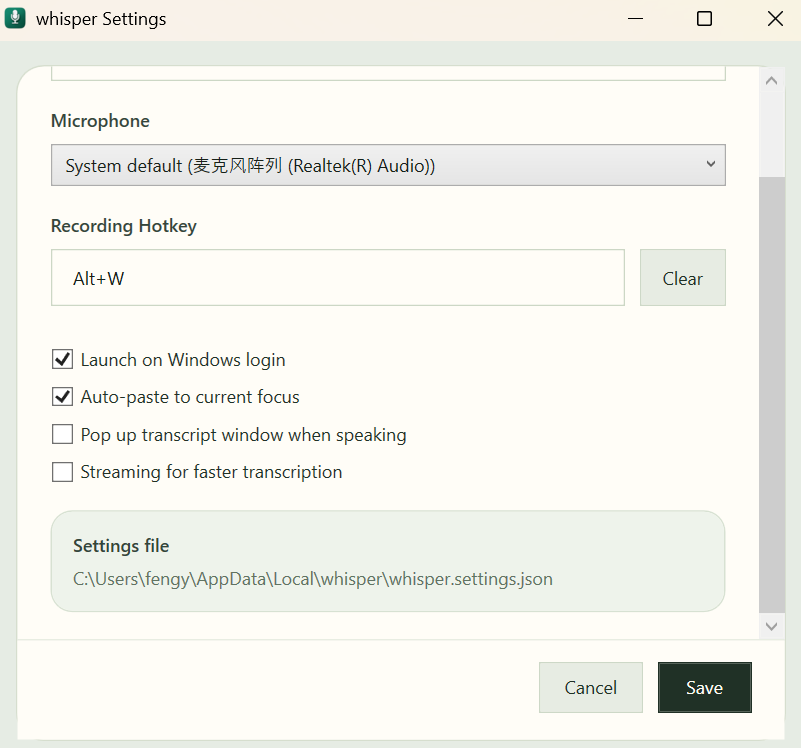

<h1> whisper</h1>

`whisper` is a fast, lightweight Windows mini app for voice-to-text daily use.

## What It Does

- Quick start/end recording from tray click or hotkey
- Auto-copy to clipboard, paste anywhere
- Fast streaming mode

## Download

Download the latest release here:

<https://github.com/LvJunYu/stt-win-mini/releases/latest>

## Install

1. Download `whisper-win-x64.zip`.
2. Extract the zip.
3. Run `whisper.exe`.

## Use It
1. Open `Settings` from the tray icon and add your OpenAI API key.
2. Start / End recording with the tray icon or your hotkey.
3. Paste the transcript anywhere.

### Settings panel

## Build & Develop

[AGENTS.md](AGENTS.md)
